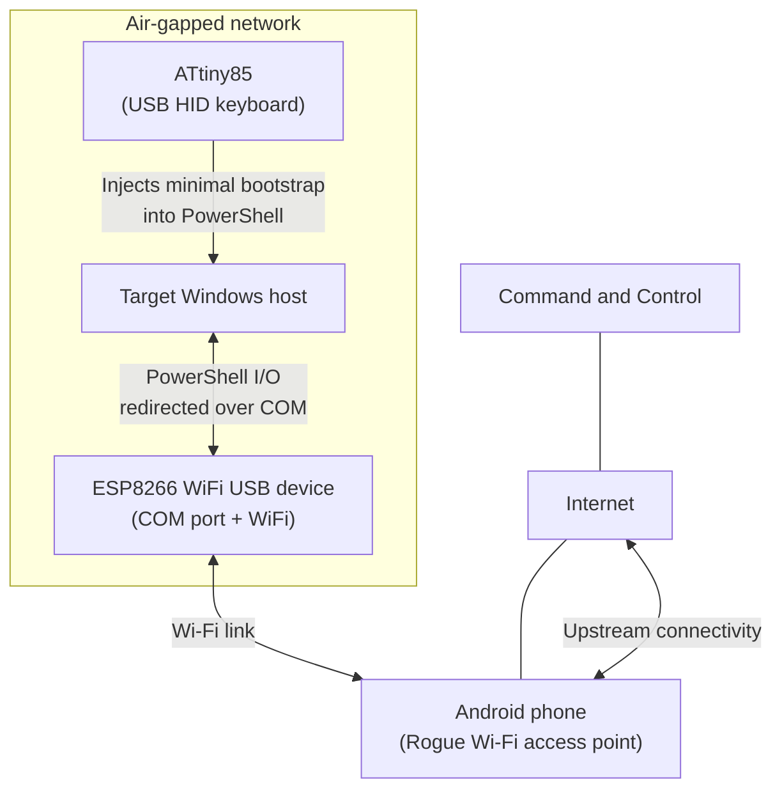

# revshellAirgap (PoC)

revshellAirgap is a proof of concept showing a lab technique to reach an interactive Reverse Shell on a network-isolated Windows host with no Internet access. For educational, authorized testing only. Do not use on systems you do not own or have explicit permission to test.

## Demo

Click below to see the video:

[](https://www.youtube.com/watch?v=v9nBg7IyuJw)

## Overview

This PoC uses three small components to relay an interactive session from an air-gapped Windows host:

- ATtiny85 (USB HID): types a short PowerShell bootstrap on the target
- ESP8266 (USB COM device): exposes a virtual COM port and forwards data between COM and a Wi-Fi connection
- Android phone: provides the Wi-Fi Rogue access point used by the ESP8266 to reach the Internet

The target does not use its own network adapters for this traffic. Data goes:
PowerShell on the target -> COM port -> ESP8266 -> Wi-Fi access point -> Internet.

## Architecture



## Components

### ATtiny85


### ESP8266 Wi-Fi


## How to test

1. Insert the following indexes in Arduino IDE, separated by commas:
   * ATtiny Core for ATtiny85: `http://drazzy.com/package_drazzy.com_index.json`
   * Arduino Core for ESP8266: `https://arduino.esp8266.com/stable/package_esp8266com_index.json`
2. From the Arduino IDE Package Manager install ATtiny Core and Arduino Code for ESP8266
2. Download the DigiKeyboard library from `https://github.com/LucaReggiannini/digikeyboard-library` and follow the instructions to install
3. From `https://github.com/micronucleus/micronucleus/blob/master/commandline/49-micronucleus.rules` insert the following code into `/etc/udev/rules.d/49-micronucleus.rules`
```bash
# UDEV Rules for Micronucleus boards including the Digispark.
# This file must be placed at:
#
# /etc/udev/rules.d/49-micronucleus.rules    (preferred location)
#   or
# /lib/udev/rules.d/49-micronucleus.rules    (req'd on some broken systems)
#
# To install, type these commands in a terminal:
#   sudo cp 49-micronucleus.rules /etc/udev/rules.d/49-micronucleus.rules
#   sudo udevadm control --reload-rules
#
# After this file is copied, physically unplug and reconnect the board.
#
SUBSYSTEMS=="usb", ATTRS{idVendor}=="16d0", ATTRS{idProduct}=="0753", MODE:="0666"
KERNEL=="ttyACM*", ATTRS{idVendor}=="16d0", ATTRS{idProduct}=="0753", MODE:="0666", ENV{ID_MM_DEVICE_IGNORE}="1"
#
# If you share your linux system with other users, or just don't like the
# idea of write permission for everybody, you can replace MODE:="0666" with
# OWNER:="yourusername" to create the device owned by you, or with
# GROUP:="somegroupname" and mange access using standard unix groups.
```
